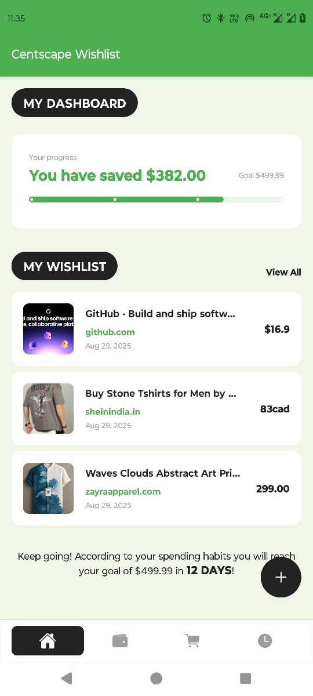
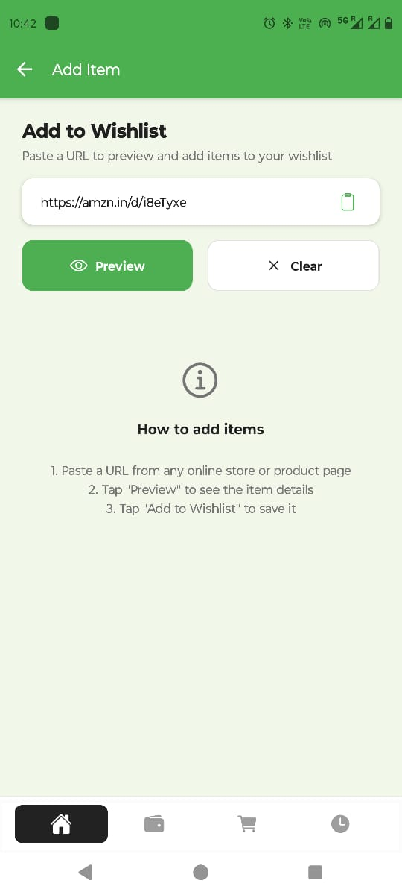
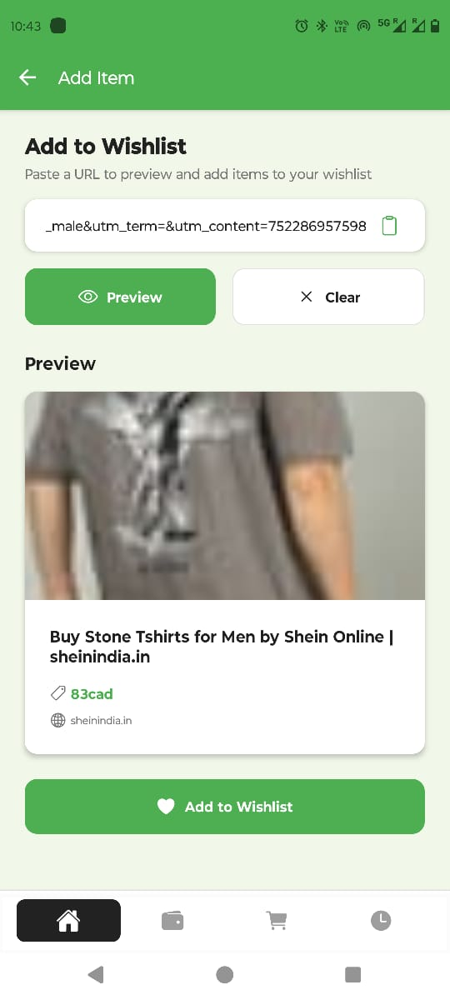
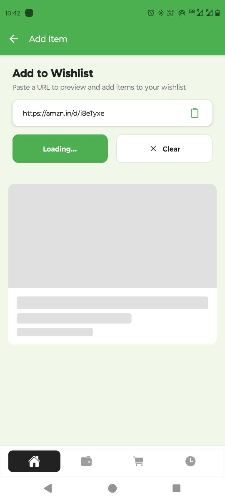
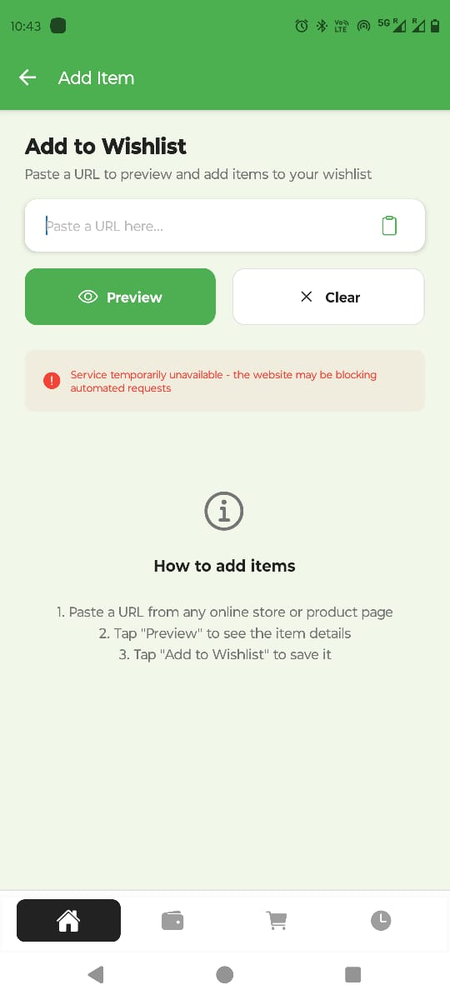

# Centscape Wishlist - Unified Wishlist Application

A full-stack wishlist application built with React Native + Expo (TypeScript) for the client and Node.js + Express (TypeScript) for the server. Users can add product URLs, preview items, and manage their wishlist with a beautiful, professional UI.



## 📱 Screenshots

| Screen | Description |
|--------|-------------|
|  | **Home Screen** - Dashboard with progress tracking and recent items |
|  | **Add to Wishlist** - URL input and preview functionality |
|  | **Preview Screen** - Product preview with extracted data |
|  | **Loading Preview** - Loading state while fetching product data |
|  | **Error Screen** - Error handling and user feedback |

## 🚀 Features

- **URL Preview**: Extract product information from any e-commerce URL
- **Wishlist Management**: Add, view, and remove items with long-press gestures
- **Progress Tracking**: Visual progress bar with goal tracking
- **Deduplication**: Prevent duplicate items with URL normalization
- **Persistence**: SQLite database with schema migration support
- **Deep Linking**: Support for `centscape://add?url=` scheme
- **Responsive Design**: Beautiful UI with light green theme
- **Accessibility**: Full accessibility support with proper labels

## 🛠️ Tech Stack

### Frontend (React Native + Expo)
- **Framework**: React Native 0.76.3 with Expo SDK 53
- **Language**: TypeScript
- **Navigation**: React Navigation (Stack Navigator)
- **State Management**: Zustand
- **Database**: Expo SQLite
- **UI Components**: Custom components with professional design
- **Performance**: FlashList for virtualized lists

### Backend (Node.js + Express)
- **Runtime**: Node.js 18+
- **Framework**: Express.js with TypeScript
- **HTTP Client**: Axios for URL fetching
- **HTML Parsing**: Cheerio for content extraction
- **Security**: Helmet, CORS, Rate limiting, SSRF protection
- **Database**: SQLite with schema migration

## 📋 Prerequisites

- **Node.js**: >= 18.0.0
- **npm**: >= 8.0.0
- **Expo CLI**: Latest version
- **Expo Go App**: For testing on mobile devices
- **Git**: For version control

## 🏗️ Project Structure

```
centscape/
├── app/                          # React Native + Expo client
│   ├── src/
│   │   ├── components/           # Reusable UI components
│   │   ├── screens/              # App screens
│   │   ├── services/             # API and database services
│   │   ├── store/                # Zustand state management
│   │   ├── theme/                # Design system and theming
│   │   ├── types/                # TypeScript type definitions
│   │   └── context/              # React Context providers
│   ├── assets/                   # Images and static assets
│   └── package.json
├── server/                       # Node.js + Express backend
│   ├── src/
│   │   ├── controllers/          # Request handlers
│   │   ├── services/             # Business logic
│   │   ├── middleware/           # Express middleware
│   │   ├── utils/                # Utility functions
│   │   └── types/                # TypeScript types
│   └── package.json
├── schemas/                      # Database schemas
├── screenshots/                  # App screenshots
└── package.json                  # Root workspace config
```

## ⚙️ Installation & Setup

### 1. Clone the Repository
```bash
git clone <repository-url>
cd centscape
```

### 2. Install Dependencies
```bash
# Install all dependencies (root, server, and app)
npm run install:all

# Or install individually:
npm install
cd server && npm install
cd ../app && npm install
```

### 3. Environment Setup

#### Server Configuration
Create `server/.env` file:
```env
PORT=3001
NODE_ENV=development
```

#### Mobile App Configuration
The app automatically detects your computer's IP address. If you need to change it manually, update `app/src/services/api.ts`:
```typescript
const API_BASE_URL = __DEV__ 
  ? 'http://YOUR_COMPUTER_IP:3001'  // Replace with your IP
  : 'https://your-production-api.com';
```

### 4. Start Development Servers

#### Option A: Start Both (Recommended)
```bash
npm run dev
```

#### Option B: Start Individually
```bash
# Terminal 1 - Start server
npm run dev:server

# Terminal 2 - Start mobile app
npm run dev:app
```

### 5. Run on Mobile Device

1. **Install Expo Go** on your mobile device
2. **Ensure both devices are on the same WiFi network**
3. **Scan the QR code** from the Expo development server
4. **Test the app** by adding URLs to your wishlist

## 🔧 Configuration

### IP Address Configuration

**Important**: The mobile app needs to connect to your computer's IP address. Follow these steps:

1. **Find your computer's IP address**:
   ```bash
   # macOS/Linux
   ifconfig | grep "inet " | grep -v 127.0.0.1
   
   # Windows
   ipconfig
   ```

2. **Update the API configuration** in `app/src/services/api.ts`:
   ```typescript
   const API_BASE_URL = __DEV__ 
     ? 'http://YOUR_IP_ADDRESS:3001'
     : 'https://your-production-api.com';
   ```

3. **Update CORS configuration** in `server/src/index.ts`:
   ```typescript
   origin: ['http://localhost:3000', 'http://localhost:19006', 'http://YOUR_IP_ADDRESS:3001']
   ```

### Database Configuration

The app uses SQLite with automatic schema migration:
- **Schema Version**: 2 (supports normalized URLs for deduplication)
- **Location**: `app/data/wishlist.db`
- **Migration**: Automatic from v1 to v2

## 🧪 Testing

### Server Tests
```bash
cd server
npm run test
npm run test:coverage
```

### App Type Checking
```bash
cd app
npm run typecheck
```

### Full Verification
```bash
npm run verify
```

## 📱 Usage

### Adding Items to Wishlist

1. **Open the app** and tap the floating action button
2. **Paste a product URL** from any e-commerce site
3. **Tap "Preview"** to see extracted product information
4. **Tap "Add to Wishlist"** to save the item

### Managing Wishlist

- **View items**: Scroll through your wishlist on the home screen
- **Remove items**: Long press any item and confirm deletion
- **Progress tracking**: View your savings progress with the interactive card

### Deep Linking

The app supports deep linking for quick item addition:
```
centscape://add?url=https://example.com/product
```

## 🔒 Security Features

### Server Security
- **SSRF Protection**: Blocks requests to private/loopback IPs
- **Rate Limiting**: 10 requests per minute per IP
- **Input Validation**: URL validation and sanitization
- **Content Security**: Helmet.js for security headers
- **CORS Protection**: Configured for development and production

### Client Security
- **Input Sanitization**: URL validation before API calls
- **Error Handling**: Graceful error handling and user feedback
- **Data Validation**: TypeScript for type safety

## 🏗️ Engineering Tradeoffs & Risks

### Tradeoffs Made

1. **SQLite vs PostgreSQL/MongoDB**
   - **Pros**: Simple setup, no external dependencies, works offline
   - **Cons**: Limited concurrent users, no built-in replication
   - **Risk**: Not suitable for high-scale production

2. **Expo vs React Native CLI**
   - **Pros**: Faster development, easier setup, managed workflow
   - **Cons**: Limited native module access, larger bundle size
   - **Risk**: May need ejection for complex native features

3. **URL Preview vs Direct Integration**
   - **Pros**: Works with any website, no API keys needed
   - **Cons**: Relies on website structure, may break with site changes
   - **Risk**: Some sites block automated requests

4. **Client-side State vs Server-side State**
   - **Pros**: Fast UI updates, works offline
   - **Cons**: No cross-device sync, data loss if app is uninstalled
   - **Risk**: Data inconsistency across devices

### Technical Risks

1. **URL Preview Reliability**
   - **Risk**: Websites may change structure or block requests
   - **Mitigation**: Multiple fallback extraction methods, error handling

2. **Network Connectivity**
   - **Risk**: Mobile app can't connect to server
   - **Mitigation**: Clear error messages, IP configuration guide

3. **Data Persistence**
   - **Risk**: SQLite database corruption or loss
   - **Mitigation**: Schema migration, backup strategies

4. **Performance**
   - **Risk**: Large wishlists may cause performance issues
   - **Mitigation**: Virtualized lists, pagination, optimization

## 🤖 AI Usage Disclosure

This project was developed with assistance from AI tools. Here's what was used and why:

### AI-Assisted Development

1. **Code Generation & Refactoring**
   - **Tool**: Claude Sonnet 4
   - **Purpose**: Initial project structure, component creation, API integration
   - **Prompts Used**:
     - "Create a full-stack wishlist app with React Native and Node.js"
     - "Implement URL preview functionality with web scraping"
     - "Design a professional UI with light green theme"
     - "Add proper error handling and loading states"

2. **Problem Solving**
   - **Tool**: Claude Sonnet 4
   - **Purpose**: Debugging network issues, dependency conflicts, styling problems
   - **Prompts Used**:
     - "Fix network error when connecting mobile app to server"
     - "Resolve Expo SDK compatibility issues"
     - "Implement proper tooltip positioning"
     - "Add long-press gesture for item deletion"

3. **Documentation**
   - **Tool**: Claude Sonnet 4
   - **Purpose**: Creating comprehensive README, code comments, setup instructions
   - **Prompts Used**:
     - "Write detailed setup instructions for the project"
     - "Document engineering tradeoffs and risks"
     - "Create user-friendly installation guide"

### Why AI Was Used

- **Rapid Prototyping**: Quick iteration on features and UI
- **Best Practices**: Ensuring code follows modern patterns and conventions
- **Problem Solving**: Efficient debugging of complex issues
- **Documentation**: Comprehensive documentation for maintainability

### Human Oversight

All AI-generated code was:
- **Reviewed** for correctness and security
- **Tested** thoroughly before implementation
- **Customized** to meet specific requirements
- **Optimized** for performance and user experience

## 🚀 Deployment

### Production Deployment

1. **Server Deployment**
   ```bash
   cd server
   npm run build
   npm start
   ```

2. **App Deployment**
   ```bash
   cd app
   expo build:android  # or expo build:ios
   ```

### Environment Variables

Set these in production:
```env
NODE_ENV=production
PORT=3001
CORS_ORIGIN=https://yourdomain.com
```

## 🤝 Contributing

1. Fork the repository
2. Create a feature branch
3. Make your changes
4. Add tests if applicable
5. Submit a pull request

## 📄 License

This project is licensed under the MIT License - see the LICENSE file for details.

## 🆘 Troubleshooting

### Common Issues

1. **Network Error on Mobile**
   - Ensure both devices are on same WiFi
   - Check IP address configuration
   - Verify server is running

2. **Expo Build Issues**
   - Clear cache: `expo r -c`
   - Update Expo CLI: `npm install -g @expo/cli`

3. **Dependency Conflicts**
   - Use `npm install --legacy-peer-deps` if needed
   - Clear node_modules and reinstall

4. **Database Issues**
   - Delete `app/data/wishlist.db` to reset
   - Check schema migration logs

### Getting Help

- Check the troubleshooting section above
- Review error logs in console
- Ensure all prerequisites are met
- Verify network connectivity

---

**Built with ❤️ using React Native, Expo, Node.js, and AI assistance**
